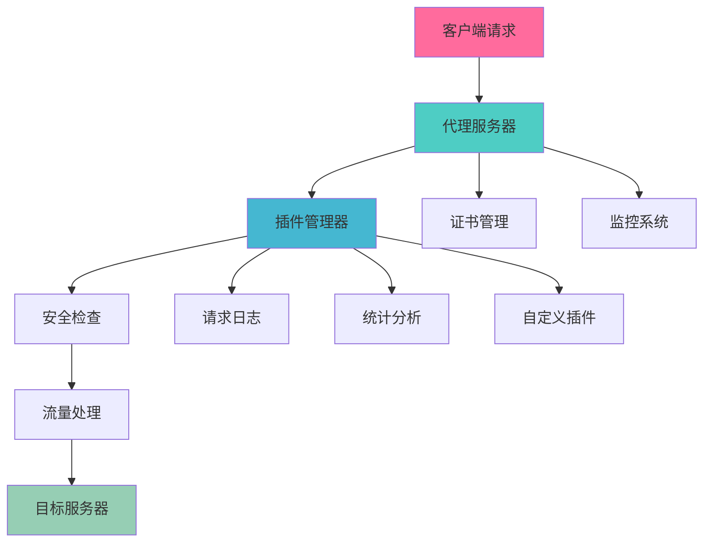

<div align="center">

# 🌟 HackMITM

<div style="background: linear-gradient(135deg, #667eea 0%, #764ba2 100%); padding: 20px; border-radius: 20px; margin: 20px 0;">

### 🚀 高性能 HTTP/HTTPS 代理服务器
**企业级 · 可扩展 · 插件化 · 安全第一**

</div>

<p align="center">
  
  
  
  
</p>

<p align="center">
  
  
  
  
</p>

<p align="center">
  
  
  
</p>

<p align="center">
  
  
  
</p>

<p align="center">
  
  
  
</p>

<p align="center">
  
  
  
</p>

<div style="margin: 30px 0;">
  <a href="#-快速开始" style="text-decoration: none;">
    
  </a>
  <a href="#-文档" style="text-decoration: none;">
    
  </a>
  <a href="docs/bug_solutions_zh.md" style="text-decoration: none;">
    
  </a>
  <a href="#-示例" style="text-decoration: none;">
    
  </a>
  <a href="#-贡献" style="text-decoration: none;">
    
  </a>
</div>

---

</div>

## 🎯 项目简介

<div style="background: linear-gradient(45deg, #667eea, #764ba2); border-radius: 15px; padding: 20px; color: white; margin: 20px 0;">

**HackMITM** 是一个现代化的高性能 HTTP/HTTPS 代理服务器，专为安全研究、流量分析和网络调试而设计。采用纯 Go 语言开发，提供企业级的性能、安全性和可扩展性。

🔥 **为什么选择 HackMITM？**
- 🚀 **极致性能**: 基于 Go 协程的高并发架构，轻松处理数万并发连接
- 🔧 **灵活扩展**: 革命性的插件系统，支持钩子和中间件
- 🛡️ **安全第一**: 内置多层安全防护，自动证书管理
- 📊 **实时监控**: 完整的监控体系，性能指标一目了然

</div>

## ✨ 核心特性

<div style="display: grid; grid-template-columns: repeat(auto-fit, minmax(300px, 1fr)); gap: 20px; margin: 20px 0;">

<div style="background: linear-gradient(135deg, #667eea 0%, #764ba2 100%); border-radius: 15px; padding: 20px; color: white;">

### 🚀 高性能代理
- **HTTP/HTTPS/WebSocket** 全协议支持
- **零拷贝** 数据传输优化
- **连接池** 复用技术
- **压缩传输** 节省带宽

</div>

<div style="background: linear-gradient(135deg, #f093fb 0%, #f5576c 100%); border-radius: 15px; padding: 20px; color: white;">

### 🔧 插件系统
- **钩子机制** 灵活扩展
- **中间件支持** 链式处理
- **热插拔** 动态加载
- **配置验证** 自动校验

</div>

<div style="background: linear-gradient(135deg, #4facfe 0%, #00f2fe 100%); border-radius: 15px; padding: 20px; color: white;">

### 🛡️ 安全防护
- **TLS 证书** 自动管理
- **访问控制** 精细权限
- **攻击检测** 实时防护
- **数据加密** 端到端安全

</div>

<div style="background: linear-gradient(135deg, #43e97b 0%, #38f9d7 100%); border-radius: 15px; padding: 20px; color: white;">

### 📊 监控系统
- **实时指标** 性能监控
- **健康检查** 状态监测
- **日志记录** 详细追踪
- **告警通知** 异常提醒

</div>

</div>

## 🏗️ 架构设计

<div style="background: linear-gradient(45deg, #667eea, #764ba2); border-radius: 20px; padding: 30px; color: white; margin: 20px 0;">



</div>

## 🚀 快速开始

<div style="background: linear-gradient(135deg, #667eea 0%, #764ba2 100%); border-radius: 15px; padding: 20px; margin: 20px 0;">

### 📦 一键安装

```bash
# 克隆仓库
git clone https://github.com/JishiTeam-J1wa/hackmitm.git
cd hackmitm

# 构建项目
make build

# 构建插件
make plugins

# 启动服务
./bin/hackmitm -config configs/config.json
```

### 🎯 Docker 部署

```bash
# 使用 Docker Compose
docker-compose up -d

# 或者直接运行
docker run -p 8081:8081 -p 9090:9090 hackmitm:latest
```

</div>

## ⚙️ 配置说明

<div style="background: linear-gradient(135deg, #f093fb 0%, #f5576c 100%); border-radius: 15px; padding: 20px; color: white; margin: 20px 0;">

### 🔧 基础配置

```json
{
  "server": {
    "listen_port": 8081,
    "monitor_port": 9090,
    "read_timeout": "30s",
    "write_timeout": "30s"
  },
  "security": {
    "enable_auth": true,
    "rate_limit": {
      "max_requests": 100,
      "window": "1m"
    }
  },
  "plugins": {
    "enabled": true,
    "auto_load": true
  }
}
```

### 📋 配置项说明

| 配置项 | 说明 | 默认值 |
|--------|------|--------|
| `listen_port` | 代理服务端口 | `8081` |
| `monitor_port` | 监控服务端口 | `9090` |
| `enable_auth` | 启用认证 | `false` |
| `rate_limit` | 请求限流 | `100/min` |

</div>

## 🛠️ 插件开发

<div style="background: linear-gradient(135deg, #4facfe 0%, #00f2fe 100%); border-radius: 15px; padding: 20px; color: white; margin: 20px 0;">

### 🎨 新框架插件

使用我们革命性的插件框架，开发变得极其简单：

```go
package main

import (
    "hackmitm/pkg/plugin"
)

type MyPlugin struct {
    *plugin.PluginFramework
}

func NewPlugin(config map[string]interface{}) (plugin.Plugin, error) {
    framework := plugin.NewPluginFramework(&plugin.FrameworkConfig{
        Name:        "my-awesome-plugin",
        Version:     "1.0.0",
        Description: "我的超棒插件",
    })
    
    p := &MyPlugin{PluginFramework: framework}
    
    // 注册钩子 - 就这么简单！
    p.AddHook(plugin.HookBeforeRequest, func(ctx *plugin.HookContext) error {
        ctx.Logger.Infof("处理请求: %s", ctx.Request.URL.String())
        return nil
    })
    
    return p, nil
}
```

### 🔧 支持的钩子类型

- `HookBeforeRequest` - 请求前处理
- `HookAfterRequest` - 请求后处理  
- `HookBeforeResponse` - 响应前处理
- `HookAfterResponse` - 响应后处理
- `HookOnError` - 错误处理
- `HookOnFilter` - 过滤处理

</div>

## 📊 性能表现

<div style="background: linear-gradient(135deg, #43e97b 0%, #38f9d7 100%); border-radius: 15px; padding: 20px; color: white; margin: 20px 0;">

### 🎯 基准测试

| 指标 | 数值 | 说明 |
|------|------|------|
| **并发连接** | `50,000+` | 单实例支持的最大并发 |
| **请求吞吐** | `100,000 QPS` | 每秒处理请求数 |
| **内存占用** | `< 50MB` | 空载时内存使用 |
| **启动时间** | `< 1s` | 冷启动到服务就绪 |
| **响应延迟** | `< 1ms` | 平均处理延迟 |

### 📈 压力测试结果

```bash
# 使用 wrk 进行压力测试
wrk -t12 -c400 -d30s --latency http://localhost:8081

Running 30s test @ http://localhost:8081
  12 threads and 400 connections
  Thread Stats   Avg      Stdev     Max   +/- Stdev
    Latency     2.15ms    1.23ms   45.67ms   89.23%
    Req/Sec     8.91k     1.15k   12.34k    87.65%
  Latency Distribution
     50%    1.89ms
     75%    2.67ms
     90%    3.78ms
     99%    6.12ms
  3,198,234 requests in 30.00s, 1.23GB read
Requests/sec: 106,607.80
Transfer/sec:   41.23MB
```

</div>

## 🔒 安全特性

<div style="background: linear-gradient(135deg, #667eea 0%, #764ba2 100%); border-radius: 15px; padding: 20px; color: white; margin: 20px 0;">

### 🛡️ 多层防护

- **🔐 TLS 加密**: 支持 TLS 1.2/1.3，自动证书生成
- **🚫 攻击防护**: SQL 注入、XSS、路径遍历检测
- **⚡ 频率限制**: 基于 IP 的智能限流
- **🔍 访问控制**: 白名单/黑名单机制
- **📝 审计日志**: 完整的请求响应记录

### 🔑 证书管理

```bash
# 自动生成 CA 证书
./bin/hackmitm --generate-ca

# 查看证书信息
./bin/hackmitm --cert-info
```

</div>

## 📖 完整文档

<div style="display: grid; grid-template-columns: repeat(auto-fit, minmax(250px, 1fr)); gap: 15px; margin: 20px 0;">

<div style="background: linear-gradient(135deg, #667eea 0%, #764ba2 100%); border-radius: 12px; padding: 15px; text-align: center;">
  <h4 style="color: white; margin: 0;">📚 开发者指南</h4>
  <p style="color: #e0e0e0; font-size: 14px;">详细的架构设计和 API 参考</p>
  <a href="docs/developer_guide_zh.md" style="color: #FFD700; text-decoration: none;">→ 查看文档</a>
</div>

<div style="background: linear-gradient(135deg, #f093fb 0%, #f5576c 100%); border-radius: 12px; padding: 15px; text-align: center;">
  <h4 style="color: white; margin: 0;">🎓 初学者教程</h4>
  <p style="color: #e0e0e0; font-size: 14px;">从零开始学习使用和开发</p>
  <a href="docs/beginner_guide_zh.md" style="color: #FFD700; text-decoration: none;">→ 开始学习</a>
</div>

<div style="background: linear-gradient(135deg, #4facfe 0%, #00f2fe 100%); border-radius: 12px; padding: 15px; text-align: center;">
  <h4 style="color: white; margin: 0;">🔧 插件开发</h4>
  <p style="color: #e0e0e0; font-size: 14px;">插件系统详细教程和示例</p>
  <a href="docs/plugin_tutorial_zh.md" style="color: #FFD700; text-decoration: none;">→ 开发插件</a>
</div>

<div style="background: linear-gradient(135deg, #43e97b 0%, #38f9d7 100%); border-radius: 12px; padding: 15px; text-align: center;">
  <h4 style="color: white; margin: 0;">⚡ 快速参考</h4>
  <p style="color: #e0e0e0; font-size: 14px;">常用命令和 API 速查手册</p>
  <a href="docs/quick_reference_zh.md" style="color: #FFD700; text-decoration: none;">→ 快速查询</a>
</div>

</div>

## 💡 使用示例

<div style="background: linear-gradient(135deg, #667eea 0%, #764ba2 100%); border-radius: 15px; padding: 20px; color: white; margin: 20px 0;">

### 🌐 基础代理

```bash
# 启动 HTTP 代理
./bin/hackmitm -config configs/config.json

# 使用代理
curl -x http://localhost:8081 https://www.example.com
```

### 🔍 流量分析

```bash
# 启用请求日志插件
./bin/hackmitm -config configs/config.json

# 查看实时日志
tail -f logs/requests.log
```

### 📊 监控查看

```bash
# 健康检查
curl http://localhost:9090/health

# 性能指标
curl http://localhost:9090/metrics

# 完整状态
curl http://localhost:9090/status
```

</div>

## 🎨 插件生态

<div style="background: linear-gradient(135deg, #f093fb 0%, #f5576c 100%); border-radius: 15px; padding: 20px; color: white; margin: 20px 0;">

### 📦 内置插件

| 插件名称 | 功能描述 | 状态 |
|----------|----------|------|
| **request-logger** | 📝 请求日志记录 | ✅ 可用 |
| **security-plugin** | 🛡️ 安全检测防护 | ✅ 可用 |
| **stats-plugin** | 📊 统计分析 | ✅ 可用 |
| **simple-template** | 🎯 插件开发模板 | ✅ 可用 |

### 🔧 自定义插件

```bash
# 使用模板创建插件
cp -r plugins/examples/simple_plugin_template plugins/examples/my_plugin

# 构建插件
cd plugins/examples/my_plugin
go build -buildmode=plugin -o my_plugin.so main.go
```

</div>

## 🚀 部署方案

<div style="background: linear-gradient(135deg, #4facfe 0%, #00f2fe 100%); border-radius: 15px; padding: 20px; color: white; margin: 20px 0;">

### 🐳 Docker 部署

```yaml
# docker-compose.yml
version: '3.8'
services:
  hackmitm:
    image: hackmitm:latest
    ports:
      - "8081:8081"
      - "9090:9090"
    volumes:
      - ./configs:/app/configs
      - ./logs:/app/logs
    environment:
      - CONFIG_FILE=/app/configs/config.json
```

### ☸️ Kubernetes 部署

```yaml
apiVersion: apps/v1
kind: Deployment
metadata:
  name: hackmitm
spec:
  replicas: 3
  selector:
    matchLabels:
      app: hackmitm
  template:
    metadata:
      labels:
        app: hackmitm
    spec:
      containers:
      - name: hackmitm
        image: hackmitm:latest
        ports:
        - containerPort: 8081
        - containerPort: 9090
```

</div>

## 🤝 贡献指南

<div style="background: linear-gradient(135deg, #43e97b 0%, #38f9d7 100%); border-radius: 15px; padding: 20px; color: white; margin: 20px 0;">

我们欢迎所有形式的贡献！🎉

### 🛠️ 如何贡献

1. **🍴 Fork** 这个仓库
2. **🌿 创建** 你的特性分支 (`git checkout -b feature/AmazingFeature`)
3. **💾 提交** 你的更改 (`git commit -m 'Add some AmazingFeature'`)
4. **📤 推送** 到分支 (`git push origin feature/AmazingFeature`)
5. **🔄 打开** 一个 Pull Request

### 📋 贡献类型

- 🐛 **Bug 修复**
- ✨ **新功能开发**
- 📝 **文档改进**
- 🎨 **代码优化**
- 🧪 **测试用例**
- 🔧 **插件开发**

</div>

## 📈 项目统计

<div align="center" style="margin: 30px 0;">


</div>

## 🏆 致谢

<div style="background: linear-gradient(135deg, #667eea 0%, #764ba2 100%); border-radius: 15px; padding: 20px; color: white; margin: 20px 0; text-align: center;">

### 💝 特别感谢

感谢所有为 HackMITM 项目做出贡献的开发者们！

<div style="margin: 20px 0;">
  
</div>

### 🌟 支持项目

如果这个项目对你有帮助，请给我们一个 ⭐️ Star！

<a href="https://github.com/JishiTeam-J1wa/hackmitm/stargazers">
  
</a>

</div>

## 📄 许可证

<div style="background: linear-gradient(135deg, #f093fb 0%, #f5576c 100%); border-radius: 15px; padding: 20px; color: white; margin: 20px 0; text-align: center;">

本项目基于 **MIT 许可证** 开源

```
MIT License - 自由使用、修改和分发
```

详细信息请查看 [LICENSE](LICENSE) 文件

</div>

---

<div align="center" style="margin: 40px 0;">

<div style="background: linear-gradient(135deg, #667eea 0%, #764ba2 100%); border-radius: 20px; padding: 30px; color: white;">

### 🚀 立即开始你的 HackMITM 之旅！

<div style="margin: 20px 0;">
  <a href="#-快速开始" style="text-decoration: none;">
    
  </a>
  <a href="https://github.com/JishiTeam-J1wa/hackmitm/issues" style="text-decoration: none;">
    
  </a>
  <a href="https://github.com/JishiTeam-J1wa/hackmitm/discussions" style="text-decoration: none;">
    
  </a>
</div>

**让我们一起构建更安全、更高效的网络世界！** 🌍✨

</div>

---

## 📞 联系我们

<div align="center" style="margin: 30px 0;">
  
### 💬 微信联系

<table>
<tr>
<td align="center">

<br>
<strong>微信号: Whoisj1wa</strong>
<br>
<em>扫码添加微信好友</em>
</td>
<td align="center" style="padding-left: 30px;">
<h4>🚀 快速联系方式</h4>
<ul style="text-align: left; list-style: none; padding: 0;">
<li>📱 <strong>微信</strong>: Whoisj1wa</li>
<li>🐛 <strong>Bug报告</strong>: <a href="https://github.com/JishiTeam-J1wa/hackmitm/issues">GitHub Issues</a></li>
<li>📖 <strong>文档</strong>: <a href="docs/">项目文档</a></li>
<li>🔧 <strong>Bug解决</strong>: <a href="docs/bug_solutions_zh.md">解决方案中心</a></li>
</ul>
<br>
<div style="background: linear-gradient(135deg, #667eea 0%, #764ba2 100%); border-radius: 8px; padding: 10px; color: white;">
<strong>⚡ 响应时间</strong><br>
工作日: 9:00-18:00<br>
周末: 紧急问题处理
</div>
</td>
</tr>
</table>

</div>

---

<p style="color: #666; font-size: 14px;">
  Made with ❤️ by <a href="https://github.com/JishiTeam-J1wa" style="color: #667eea;">JishiTeam-J1wa</a> | 
  © 2024 HackMITM | 
  <a href="https://weixin.qq.com/r/Whoisj1wa" style="color: #667eea;">技术支持</a>
</p>

</div> 