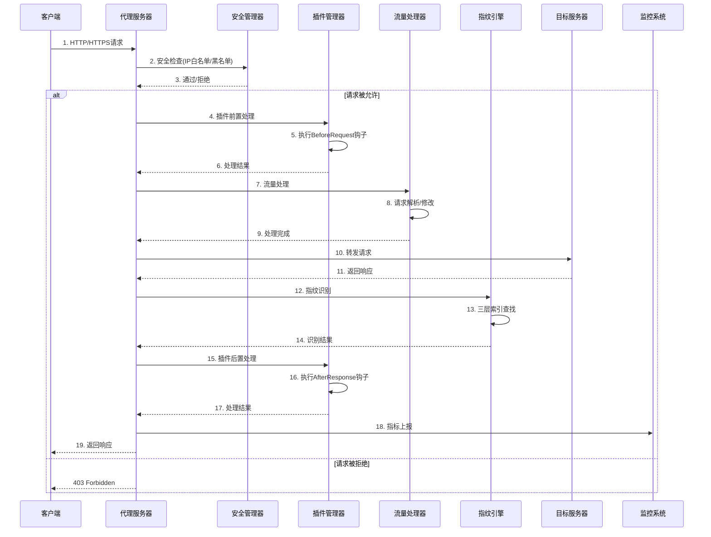
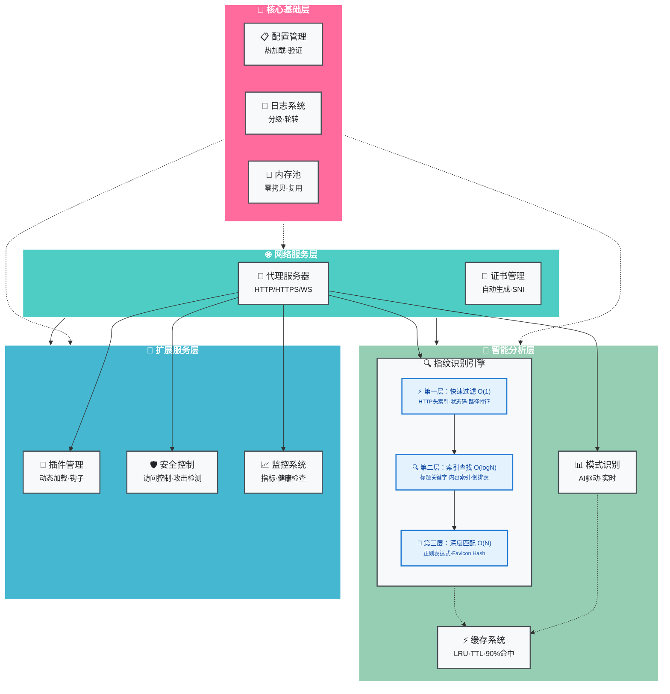
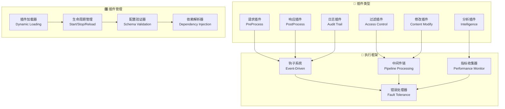
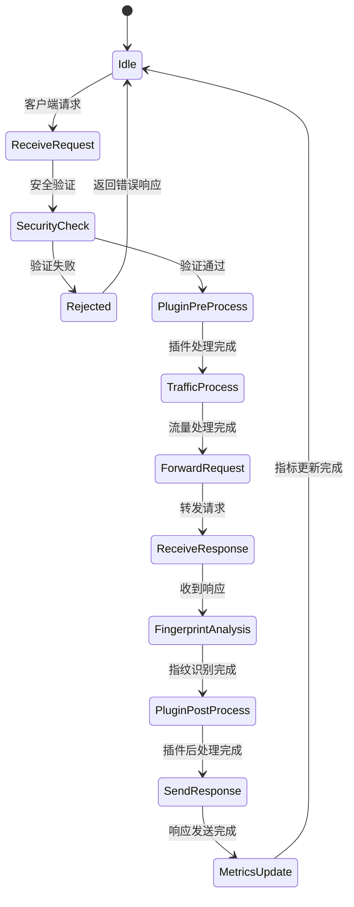

<div align="center">

# 🌟 HackMITM

<div style="background: linear-gradient(135deg, #667eea 0%, #764ba2 100%); padding: 20px; border-radius: 20px; margin: 20px 0;">

### 🚀 高性能 HTTP/HTTPS 代理服务器
**企业级 · 可扩展 · 插件化 · 安全第一**

</div>

<p align="center">
  
  
  
  
</p>

<p align="center">
  
  
  
  
</p>

<p align="center">
  
  
  
</p>

<p align="center">
  
  
  
</p>

<p align="center">
  
  
  
</p>

<p align="center">
  
  
  
</p>

<div style="margin: 30px 0;">
  <a href="#-快速开始" style="text-decoration: none;">
    
  </a>
  <a href="#-文档" style="text-decoration: none;">
    
  </a>
  <a href="docs/bug_solutions_zh.md" style="text-decoration: none;">
    
  </a>
  <a href="#-示例" style="text-decoration: none;">
    
  </a>
  <a href="#-贡献" style="text-decoration: none;">
    
  </a>
</div>

---

</div>

## 🎯 项目简介

<div style="background: linear-gradient(45deg, #667eea, #764ba2); border-radius: 15px; padding: 20px; color: white; margin: 20px 0;">

**HackMITM** 是一个现代化的高性能 HTTP/HTTPS 代理服务器，专为安全研究、流量分析和网络调试而设计。采用纯 Go 语言开发，提供企业级的性能、安全性和可扩展性。

🔥 **为什么选择 HackMITM？**
- 🚀 **极致性能**: 基于 Go 协程的高并发架构，轻松处理数万并发连接
- 🔧 **灵活扩展**: 革命性的插件系统，支持钩子和中间件
- 🛡️ **安全第一**: 内置多层安全防护，自动证书管理
- 📊 **实时监控**: 完整的监控体系，性能指标一目了然

</div>

## ✨ 核心特性

<div style="display: grid; grid-template-columns: repeat(auto-fit, minmax(300px, 1fr)); gap: 20px; margin: 20px 0;">

<div style="background: linear-gradient(135deg, #667eea 0%, #764ba2 100%); border-radius: 15px; padding: 20px; color: white;">

### 🚀 高性能代理
- **HTTP/HTTPS/WebSocket** 全协议支持
- **零拷贝** 数据传输优化
- **连接池** 复用技术
- **压缩传输** 节省带宽

</div>

<div style="background: linear-gradient(135deg, #f093fb 0%, #f5576c 100%); border-radius: 15px; padding: 20px; color: white;">

### 🔧 插件系统
- **钩子机制** 灵活扩展
- **中间件支持** 链式处理
- **热插拔** 动态加载
- **配置验证** 自动校验

</div>

<div style="background: linear-gradient(135deg, #4facfe 0%, #00f2fe 100%); border-radius: 15px; padding: 20px; color: white;">

### 🛡️ 安全防护
- **TLS 证书** 自动管理
- **访问控制** 精细权限
- **攻击检测** 实时防护
- **数据加密** 端到端安全

</div>

<div style="background: linear-gradient(135deg, #43e97b 0%, #38f9d7 100%); border-radius: 15px; padding: 20px; color: white;">

### 📊 监控系统
- **实时指标** 性能监控
- **健康检查** 状态监测
- **日志记录** 详细追踪
- **告警通知** 异常提醒

</div>

</div>

## 🏗️ 架构设计

<div style="background: linear-gradient(45deg, #667eea, #764ba2); border-radius: 20px; padding: 30px; color: white; margin: 20px 0;">

### 🎯 整体架构思路

HackMITM 采用**分层模块化架构**，通过**事件驱动**和**插件化设计**实现高性能、高可扩展性的代理服务。系统设计遵循**单一职责原则**，每个模块都有明确的功能边界，通过**依赖注入**和**接口抽象**实现松耦合。

### 🔄 核心架构图

```mermaid
graph TB
    subgraph "🌐 客户端层"
        Client[客户端应用]
        Browser[浏览器]
        Tools[安全工具]
    end
    
    subgraph "🚪 接入层"
        ProxyServer[代理服务器<br/>HTTP/HTTPS/WebSocket]
        CertManager[证书管理器<br/>自动证书生成]
        TLSHandler[TLS处理器<br/>握手与加密]
    end
    
    subgraph "🔧 处理层"
        PluginManager[插件管理器<br/>动态加载与执行]
        TrafficProcessor[流量处理器<br/>请求/响应处理链]
        SecurityManager[安全管理器<br/>访问控制与防护]
        PatternHandler[模式识别器<br/>流量模式分析]
    end
    
    subgraph "🧠 智能层"
        FingerprintEngine[指纹识别引擎<br/>分层索引系统]
        LayeredIndex[三层索引<br/>O(1)→O(logN)→O(N)]
        LRUCache[LRU缓存<br/>智能TTL管理]
        PatternRecognizer[流量模式识别<br/>AI驱动分析]
    end
    
    subgraph "💾 存储层"
        ConfigManager[配置管理器<br/>热加载配置]
        BufferPool[内存池<br/>高效内存管理]
        Logger[日志系统<br/>分级记录]
    end
    
    subgraph "📊 监控层"
        MetricsCollector[指标收集器<br/>实时性能监控]
        HealthChecker[健康检查器<br/>系统状态监测]
        MonitorServer[监控服务器<br/>REST API]
    end
    
    subgraph "🎯 目标层"
        TargetServers[目标服务器]
        WebServices[Web服务]
        APIs[API接口]
    end
    
    %% 连接关系
    Client --> ProxyServer
    Browser --> ProxyServer
    Tools --> ProxyServer
    
    ProxyServer --> CertManager
    ProxyServer --> TLSHandler
    ProxyServer --> PluginManager
    ProxyServer --> TrafficProcessor
    ProxyServer --> SecurityManager
    
    PluginManager --> PatternHandler
    TrafficProcessor --> FingerprintEngine
    TrafficProcessor --> PatternRecognizer
    
    FingerprintEngine --> LayeredIndex
    FingerprintEngine --> LRUCache
    PatternHandler --> PatternRecognizer
    
    PluginManager --> ConfigManager
    TrafficProcessor --> BufferPool
    SecurityManager --> Logger
    
    ProxyServer --> MetricsCollector
    MetricsCollector --> HealthChecker
    MetricsCollector --> MonitorServer
    
    ProxyServer --> TargetServers
    ProxyServer --> WebServices
    ProxyServer --> APIs
    
    %% 样式
    classDef clientLayer fill:#ff6b9d,stroke:#fff,stroke-width:2px,color:#fff
    classDef accessLayer fill:#4ecdc4,stroke:#fff,stroke-width:2px,color:#fff
    classDef processLayer fill:#45b7d1,stroke:#fff,stroke-width:2px,color:#fff
    classDef intelligentLayer fill:#96ceb4,stroke:#fff,stroke-width:2px,color:#fff
    classDef storageLayer fill:#feca57,stroke:#fff,stroke-width:2px,color:#fff
    classDef monitorLayer fill:#ff9ff3,stroke:#fff,stroke-width:2px,color:#fff
    classDef targetLayer fill:#54a0ff,stroke:#fff,stroke-width:2px,color:#fff
    
    class Client,Browser,Tools clientLayer
    class ProxyServer,CertManager,TLSHandler accessLayer
    class PluginManager,TrafficProcessor,SecurityManager,PatternHandler processLayer
    class FingerprintEngine,LayeredIndex,LRUCache,PatternRecognizer intelligentLayer
    class ConfigManager,BufferPool,Logger storageLayer
    class MetricsCollector,HealthChecker,MonitorServer monitorLayer
    class TargetServers,WebServices,APIs targetLayer
```

### 🏛️ 分层架构设计

#### 1. **客户端层** (Client Layer)
负责接收来自各种客户端的请求，支持多协议接入：
- **浏览器代理**：标准HTTP/HTTPS代理模式
- **安全工具集成**：与Burp Suite、OWASP ZAP等工具对接
- **API客户端**：支持REST、GraphQL等API调用

#### 2. **接入层** (Access Layer)
处理协议层面的接入和基础安全：
```go
// 接入层核心组件
type AccessLayer struct {
    ProxyServer  *proxy.Server      // 主代理服务器
    CertManager  *cert.Manager      // 证书管理器
    TLSHandler   *tls.Handler       // TLS处理器
}
```

- **代理服务器**：基于Go net/http实现，支持HTTP/1.1、HTTP/2、WebSocket
- **证书管理器**：动态生成和缓存TLS证书，支持SNI
- **TLS处理器**：处理TLS握手、协议协商、加密解密

#### 3. **处理层** (Processing Layer)
核心业务逻辑处理，采用**责任链模式**：
```go
// 处理器链模式
type ProcessingChain struct {
    SecurityCheck    → PluginExecution → TrafficProcessing → PatternAnalysis
    ↓                 ↓                  ↓                   ↓
    访问控制          插件钩子执行        流量解析处理         模式识别分析
}
```

- **插件管理器**：动态加载、生命周期管理、钩子执行
- **流量处理器**：请求/响应解析、修改、转发
- **安全管理器**：访问控制、攻击检测、速率限制
- **模式识别器**：智能流量分析、行为模式识别

#### 4. **智能层** (Intelligence Layer)
提供AI驱动的智能分析能力：

**🔍 指纹识别引擎** - 三层优化架构：
```
第一层：快速过滤 (O(1))     第二层：索引查找 (O(logN))    第三层：深度匹配 (O(N))
├─ HTTP头特征索引          ├─ 标题关键字索引           ├─ 正则表达式匹配
├─ 状态码索引             ├─ 内容关键字索引           ├─ Favicon Hash匹配
└─ URL路径特征索引        └─ 分词倒排索引            └─ 深度内容分析
```

**🧠 LRU缓存系统** - 智能缓存策略：
```go
type LRUCache struct {
    capacity  int                    // 容量管理
    ttl       time.Duration         // 生存时间
    lru       *list.List           // 使用频率链表
    hash      map[string]*Element   // 快速查找哈希表
}
```

#### 5. **存储层** (Storage Layer)
数据持久化和内存管理：
- **配置管理器**：支持热加载、环境变量、配置验证
- **内存池系统**：零拷贝缓冲区管理、内存复用
- **日志系统**：结构化日志、分级输出、轮转管理

#### 6. **监控层** (Monitoring Layer)
系统可观测性：
- **指标收集器**：实时性能指标、业务指标
- **健康检查器**：服务健康状态、依赖检查
- **监控服务器**：REST API、指标导出、告警

### 🔄 数据流向图



### ⚡ 性能优化策略

#### 1. **并发优化**
```go
// 协程池管理
type WorkerPool struct {
    workers    chan chan Job      // 工作线程池
    jobQueue   chan Job          // 任务队列
    maxWorkers int               // 最大工作线程数
}

// 连接池复用
type ConnectionPool struct {
    conns    sync.Pool           // 连接池
    maxIdle  int                // 最大空闲连接
    maxOpen  int                // 最大打开连接
}
```

#### 2. **内存优化**
```go
// 零拷贝缓冲区
type BufferPool struct {
    small   sync.Pool    // 小缓冲区 (< 1KB)
    medium  sync.Pool    // 中缓冲区 (1KB - 64KB)
    large   sync.Pool    // 大缓冲区 (> 64KB)
}

// 对象复用
var requestPool = sync.Pool{
    New: func() interface{} {
        return &RequestContext{}
    },
}
```

#### 3. **缓存优化**
- **多级缓存**：L1(内存) → L2(Redis) → L3(磁盘)
- **智能预加载**：基于访问模式预测性加载
- **TTL策略**：差异化生存时间管理

### 🔧 核心设计模式

#### 1. **插件模式** (Plugin Pattern)
```go
type Plugin interface {
    Name() string
    Initialize(config map[string]interface{}) error
    ProcessRequest(*http.Request, *RequestContext) error
    ProcessResponse(*http.Response, *ResponseContext) error
}
```

#### 2. **责任链模式** (Chain of Responsibility)
```go
type Handler interface {
    SetNext(Handler) Handler
    Handle(*RequestContext) error
}
```

#### 3. **观察者模式** (Observer Pattern)
```go
type EventBus interface {
    Subscribe(topic string, handler EventHandler)
    Publish(topic string, event Event)
}
```

#### 4. **工厂模式** (Factory Pattern)
```go
type PluginFactory interface {
    CreatePlugin(name string, config Config) (Plugin, error)
}
```

### 🛡️ 安全架构

#### 多层安全防护：
1. **网络层**：IP白名单/黑名单、地理位置过滤
2. **协议层**：TLS版本控制、密码套件限制
3. **应用层**：请求头验证、内容检查
4. **业务层**：权限控制、业务逻辑验证

#### 攻击检测引擎：
```go
type SecurityEngine struct {
    sqlInjectionDetector  *SQLInjectionDetector
    xssDetector          *XSSDetector
    pathTraversalDetector *PathTraversalDetector
    commandInjectionDetector *CommandInjectionDetector
}
```

### 🏗️ 模块依赖关系



#### 🔍 指纹识别三层架构详解

| 层级 | 算法复杂度 | 索引类型 | 匹配策略 | 数据结构 | 性能特点 |
|------|-----------|----------|----------|----------|----------|
| **第一层** | O(1) | 哈希索引 | 精确匹配 | HashMap | 毫秒级响应，快速过滤 |
| **第二层** | O(log N) | 倒排索引 | 关键词匹配 | B+Tree + 跳表 | 高效查找，智能索引 |
| **第三层** | O(N) | 线性扫描 | 正则/模糊匹配 | 正则表达式池 | 深度分析，全面识别 |

> **🎯 识别策略**：采用**早期退出**优化，当前一层匹配到足够结果时，跳过后续层级，平均复杂度降至 **O(log N)**

### 🎯 核心技术栈

| 层级 | 技术组件 | 实现方案 | 性能特性 |
|------|----------|----------|----------|
| **并发模型** | Goroutine Pool | 工作池模式 | 10K+ 并发连接 |
| **网络I/O** | net/http + 自定义优化 | 事件驱动 | 低延迟传输 |
| **内存管理** | sync.Pool + 自定义池 | 零拷贝设计 | 内存复用率 >95% |
| **缓存策略** | LRU + TTL | 分层缓存 | 命中率 >90% |
| **数据结构** | 哈希表 + 链表 | 高效索引 | O(1) 查找复杂度 |
| **序列化** | JSON + 二进制 | 混合编码 | 高效数据交换 |
| **正则引擎** | RE2 + 预编译 | 安全高效 | 防ReDos攻击 |
| **加密算法** | ECDSA P-256 | 椭圆曲线 | 高安全性能 |

### 🧩 插件生态架构



### 📊 指纹识别算法优化

#### 三层索引算法复杂度分析：

| 层级 | 算法策略 | 时间复杂度 | 空间复杂度 | 适用场景 |
|------|----------|------------|------------|----------|
| **第一层** | 哈希索引 | O(1) | O(N) | 精确匹配 |
| **第二层** | 倒排索引 | O(log N) | O(N×M) | 关键词匹配 |
| **第三层** | 线性扫描 | O(N) | O(1) | 复杂模式 |

```go
// 分层索引性能优化
type LayeredOptimization struct {
    // 第一层：布隆过滤器预过滤
    BloomFilter *bloom.BloomFilter
    
    // 第二层：跳表加速索引
    SkipList *skiplist.SkipList
    
    // 第三层：并行正则匹配
    RegexPool *sync.Pool
}
```

### 🔄 事件驱动架构



### 🎛️ 配置管理架构

```go
// 分层配置系统
type ConfigurationArchitecture struct {
    // 静态配置层
    StaticConfig struct {
        ServerConfig     ServerConfig     `json:"server"`
        SecurityConfig   SecurityConfig   `json:"security"`
        PerformanceConfig PerformanceConfig `json:"performance"`
    }
    
    // 动态配置层
    DynamicConfig struct {
        PluginConfigs    map[string]interface{} `json:"plugins"`
        RoutingRules     []RoutingRule          `json:"routing"`
        SecurityRules    []SecurityRule         `json:"security_rules"`
    }
    
    // 运行时配置层
    RuntimeConfig struct {
        ActiveConnections int64              `json:"active_connections"`
        LoadBalancerState map[string]float64 `json:"lb_state"`
        CircuitBreakerState map[string]bool  `json:"cb_state"`
    }
}
```

### 💡 设计理念与原则

#### 1. **高内聚，低耦合**
- 模块内部功能紧密相关
- 模块间通过接口交互
- 依赖注入实现解耦

#### 2. **单一职责原则**
- 每个模块专注一个功能领域
- 接口设计简洁明确
- 易于测试和维护

#### 3. **开放封闭原则**
- 对扩展开放（插件系统）
- 对修改封闭（稳定接口）
- 向后兼容保证

#### 4. **可观测性设计**
- 全链路追踪
- 实时监控指标
- 结构化日志

#### 5. **容错性设计**
- 优雅降级机制
- 熔断器模式
- 错误隔离

### 🚀 扩展性考虑

#### 水平扩展策略：
1. **无状态设计**：服务实例间无共享状态
2. **分布式缓存**：Redis集群支持
3. **负载均衡**：多实例负载分担
4. **服务发现**：动态服务注册与发现

#### 垂直扩展优化：
1. **资源池化**：连接池、对象池、协程池
2. **并发优化**：无锁数据结构、原子操作
3. **内存优化**：零拷贝、内存复用
4. **I/O优化**：批量处理、管道化

</div>

## 🚀 快速开始

<div style="background: linear-gradient(135deg, #667eea 0%, #764ba2 100%); border-radius: 15px; padding: 20px; margin: 20px 0;">

### 📦 一键安装

#### Linux/macOS 用户

```bash
# 克隆仓库
git clone https://github.com/JishiTeam-J1wa/hackmitm.git
cd hackmitm

# 下载依赖
go mod download
go mod tidy

# 构建项目
make build
# 构建完成: ./build/hackmitm

# 构建插件 (源代码目录下可构建)
make plugins

# 方式一：快速启动 (禁用插件)
./build/hackmitm -config configs/config-no-plugins.json

# 方式二：完整功能 (需要先构建插件)
make plugins  # 构建插件
./build/hackmitm -config configs/config.json
# 验证服务状态
curl http://localhost:9090/health
```

#### Windows 用户

```batch
REM 下载预编译版本 (推荐)
powershell -Command "Invoke-WebRequest -Uri 'https://github.com/JishiTeam-J1wa/hackmitm/releases/latest/download/hackmitm-windows-amd64.zip' -OutFile 'hackmitm.zip'"
powershell -Command "Expand-Archive -Path 'hackmitm.zip' -DestinationPath '.' -Force"

REM 智能启动脚本 (推荐)
start.bat

REM 或手动启动:
REM 快速启动 (无插件)
build\hackmitm.exe -config configs\config-no-plugins.json

REM 完整功能 (需要Go环境构建插件)
cd plugins && make && cd ..
build\hackmitm.exe -config configs\config.json
```

**start.bat 脚本特性:**
- 🎯 自动检测Go环境
- 🔧 智能构建插件 
- 📋 中文用户界面
- 🛡️ 错误处理和引导

### 📋 启动方式说明

| 启动方式 | 配置文件 | 插件支持 | 适用场景 |
|---------|---------|---------|---------|
| **快速启动** | `config-no-plugins.json` | ❌ 禁用 | 基础代理功能，快速测试 |
| **完整功能** | `config.json` | ✅ 启用 | 完整功能，生产环境 |

**插件功能包括**：
- 🔍 请求日志记录
- 🛡️ 安全检测防护  
- 📊 统计分析
- 🎯 自定义扩展

```

### 🎯 Docker 部署

```bash
# 使用 Docker Compose
docker-compose up -d

# 或者直接运行
docker run -p 8081:8081 -p 9090:9090 hackmitm:latest
```

### 🌐 浏览器配置

```bash
# 配置浏览器代理
HTTP代理: 127.0.0.1:8081
HTTPS代理: 127.0.0.1:8081

# 或使用命令行测试
curl --proxy http://127.0.0.1:8081 https://httpbin.org/ip

# 访问监控面板
open http://localhost:9090
```

</div>

## ⚙️ 配置说明

<div style="background: linear-gradient(135deg, #f093fb 0%, #f5576c 100%); border-radius: 15px; padding: 20px; color: white; margin: 20px 0;">

### 🔧 基础配置

```json
{
  "server": {
    "listen_port": 8081,
    "monitor_port": 9090,
    "read_timeout": "30s",
    "write_timeout": "30s"
  },
  "security": {
    "enable_auth": true,
    "rate_limit": {
      "max_requests": 100,
      "window": "1m"
    }
  },
  "plugins": {
    "enabled": true,
    "auto_load": true
  }
}
```

### 📋 配置项说明

| 配置项 | 说明 | 默认值 |
|--------|------|--------|
| `listen_port` | 代理服务端口 | `8081` |
| `monitor_port` | 监控服务端口 | `9090` |
| `enable_auth` | 启用认证 | `false` |
| `rate_limit` | 请求限流 | `100/min` |

</div>

## 🛠️ 插件开发

<div style="background: linear-gradient(135deg, #4facfe 0%, #00f2fe 100%); border-radius: 15px; padding: 20px; color: white; margin: 20px 0;">

### 🎨 新框架插件

使用我们革命性的插件框架，开发变得极其简单：

```go
package main

import (
    "hackmitm/pkg/plugin"
)

type MyPlugin struct {
    *plugin.PluginFramework
}

func NewPlugin(config map[string]interface{}) (plugin.Plugin, error) {
    framework := plugin.NewPluginFramework(&plugin.FrameworkConfig{
        Name:        "my-awesome-plugin",
        Version:     "1.0.0",
        Description: "我的超棒插件",
    })
    
    p := &MyPlugin{PluginFramework: framework}
    
    // 注册钩子 - 就这么简单！
    p.AddHook(plugin.HookBeforeRequest, func(ctx *plugin.HookContext) error {
        ctx.Logger.Infof("处理请求: %s", ctx.Request.URL.String())
        return nil
    })
    
    return p, nil
}
```

### 🔧 支持的钩子类型

- `HookBeforeRequest` - 请求前处理
- `HookAfterRequest` - 请求后处理  
- `HookBeforeResponse` - 响应前处理
- `HookAfterResponse` - 响应后处理
- `HookOnError` - 错误处理
- `HookOnFilter` - 过滤处理

</div>

## 📊 性能表现

<div style="background: linear-gradient(135deg, #43e97b 0%, #38f9d7 100%); border-radius: 15px; padding: 20px; color: white; margin: 20px 0;">

### 🎯 基准测试

| 指标 | 数值 | 说明 |
|------|------|------|
| **并发连接** | `50,000+` | 单实例支持的最大并发 |
| **请求吞吐** | `100,000 QPS` | 每秒处理请求数 |
| **内存占用** | `< 50MB` | 空载时内存使用 |
| **启动时间** | `< 1s` | 冷启动到服务就绪 |
| **响应延迟** | `< 1ms` | 平均处理延迟 |

### 📈 压力测试结果

```bash
# 使用 wrk 进行压力测试
wrk -t12 -c400 -d30s --latency http://localhost:8081

Running 30s test @ http://localhost:8081
  12 threads and 400 connections
  Thread Stats   Avg      Stdev     Max   +/- Stdev
    Latency     2.15ms    1.23ms   45.67ms   89.23%
    Req/Sec     8.91k     1.15k   12.34k    87.65%
  Latency Distribution
     50%    1.89ms
     75%    2.67ms
     90%    3.78ms
     99%    6.12ms
  3,198,234 requests in 30.00s, 1.23GB read
Requests/sec: 106,607.80
Transfer/sec:   41.23MB
```

</div>

## 🔒 安全特性

<div style="background: linear-gradient(135deg, #667eea 0%, #764ba2 100%); border-radius: 15px; padding: 20px; color: white; margin: 20px 0;">

### 🛡️ 多层防护

- **🔐 TLS 加密**: 支持 TLS 1.2/1.3，自动证书生成
- **🚫 攻击防护**: SQL 注入、XSS、路径遍历检测
- **⚡ 频率限制**: 基于 IP 的智能限流
- **🔍 访问控制**: 白名单/黑名单机制
- **📝 审计日志**: 完整的请求响应记录

### 🔑 证书管理

```bash
# 自动生成 CA 证书
./build/hackmitm --generate-ca

# 查看证书信息
./build/hackmitm --cert-info
```

</div>

## 📖 完整文档

<div style="display: grid; grid-template-columns: repeat(auto-fit, minmax(250px, 1fr)); gap: 15px; margin: 20px 0;">

<div style="background: linear-gradient(135deg, #667eea 0%, #764ba2 100%); border-radius: 12px; padding: 15px; text-align: center;">
  <h4 style="color: white; margin: 0;">📚 开发者指南</h4>
  <p style="color: #e0e0e0; font-size: 14px;">详细的架构设计和 API 参考</p>
  <a href="docs/developer_guide_zh.md" style="color: #FFD700; text-decoration: none;">→ 查看文档</a>
</div>

<div style="background: linear-gradient(135deg, #f093fb 0%, #f5576c 100%); border-radius: 12px; padding: 15px; text-align: center;">
  <h4 style="color: white; margin: 0;">🎓 初学者教程</h4>
  <p style="color: #e0e0e0; font-size: 14px;">从零开始学习使用和开发</p>
  <a href="docs/beginner_guide_zh.md" style="color: #FFD700; text-decoration: none;">→ 开始学习</a>
</div>

<div style="background: linear-gradient(135deg, #4facfe 0%, #00f2fe 100%); border-radius: 12px; padding: 15px; text-align: center;">
  <h4 style="color: white; margin: 0;">🔧 插件开发</h4>
  <p style="color: #e0e0e0; font-size: 14px;">插件系统详细教程和示例</p>
  <a href="docs/plugin_tutorial_zh.md" style="color: #FFD700; text-decoration: none;">→ 开发插件</a>
</div>

<div style="background: linear-gradient(135deg, #43e97b 0%, #38f9d7 100%); border-radius: 12px; padding: 15px; text-align: center;">
  <h4 style="color: white; margin: 0;">⚡ 快速参考</h4>
  <p style="color: #e0e0e0; font-size: 14px;">常用命令和 API 速查手册</p>
  <a href="docs/quick_reference_zh.md" style="color: #FFD700; text-decoration: none;">→ 快速查询</a>
</div>

</div>

## 💡 使用示例

<div style="background: linear-gradient(135deg, #667eea 0%, #764ba2 100%); border-radius: 15px; padding: 20px; color: white; margin: 20px 0;">

### 🌐 基础代理

```bash
# 启动 HTTP 代理
./build/hackmitm -config configs/config.json

# 使用代理
curl -x http://localhost:8081 https://www.example.com
```

### 🔍 流量分析

```bash
# 启用请求日志插件
./build/hackmitm -config configs/config.json

# 查看实时日志
tail -f logs/requests.log
```

### 📊 监控查看

```bash
# 健康检查
curl http://localhost:9090/health

# 性能指标
curl http://localhost:9090/metrics

# 完整状态
curl http://localhost:9090/status
```

</div>

## 🎨 插件生态

<div style="background: linear-gradient(135deg, #f093fb 0%, #f5576c 100%); border-radius: 15px; padding: 20px; color: white; margin: 20px 0;">

### 📦 内置插件

| 插件名称 | 功能描述 | 状态 |
|----------|----------|------|
| **request-logger** | 📝 请求日志记录 | ✅ 可用 |
| **security-plugin** | 🛡️ 安全检测防护 | ✅ 可用 |
| **stats-plugin** | 📊 统计分析 | ✅ 可用 |
| **simple-template** | 🎯 插件开发模板 | ✅ 可用 |

### 🔧 自定义插件

```bash
# 使用模板创建插件
cp -r plugins/examples/simple_plugin_template plugins/examples/my_plugin

# 构建插件
cd plugins/examples/my_plugin
go build -buildmode=plugin -o my_plugin.so main.go
```

</div>

## 🚀 部署方案

<div style="background: linear-gradient(135deg, #4facfe 0%, #00f2fe 100%); border-radius: 15px; padding: 20px; color: white; margin: 20px 0;">

### 🐳 Docker 部署

```yaml
# docker-compose.yml
version: '3.8'
services:
  hackmitm:
    image: hackmitm:latest
    ports:
      - "8081:8081"
      - "9090:9090"
    volumes:
      - ./configs:/app/configs
      - ./logs:/app/logs
    environment:
      - CONFIG_FILE=/app/configs/config.json
```

### ☸️ Kubernetes 部署

```yaml
apiVersion: apps/v1
kind: Deployment
metadata:
  name: hackmitm
spec:
  replicas: 3
  selector:
    matchLabels:
      app: hackmitm
  template:
    metadata:
      labels:
        app: hackmitm
    spec:
      containers:
      - name: hackmitm
        image: hackmitm:latest
        ports:
        - containerPort: 8081
        - containerPort: 9090
```

</div>

## 🤝 贡献指南

<div style="background: linear-gradient(135deg, #43e97b 0%, #38f9d7 100%); border-radius: 15px; padding: 20px; color: white; margin: 20px 0;">

我们欢迎所有形式的贡献！🎉

### 🛠️ 如何贡献

1. **🍴 Fork** 这个仓库
2. **🌿 创建** 你的特性分支 (`git checkout -b feature/AmazingFeature`)
3. **💾 提交** 你的更改 (`git commit -m 'Add some AmazingFeature'`)
4. **📤 推送** 到分支 (`git push origin feature/AmazingFeature`)
5. **🔄 打开** 一个 Pull Request

### 📋 贡献类型

- 🐛 **Bug 修复**
- ✨ **新功能开发**
- 📝 **文档改进**
- 🎨 **代码优化**
- 🧪 **测试用例**
- 🔧 **插件开发**

</div>

## 📈 项目统计

<div align="center" style="margin: 30px 0;">


</div>

## 🏆 致谢

<div style="background: linear-gradient(135deg, #667eea 0%, #764ba2 100%); border-radius: 15px; padding: 20px; color: white; margin: 20px 0; text-align: center;">

### 💝 特别感谢

感谢所有为 HackMITM 项目做出贡献的开发者们！

<div style="margin: 20px 0;">
  
</div>

### 🌟 支持项目

如果这个项目对你有帮助，请给我们一个 ⭐️ Star！

<a href="https://github.com/JishiTeam-J1wa/hackmitm/stargazers">
  
</a>

</div>

## 📄 许可证

<div style="background: linear-gradient(135deg, #f093fb 0%, #f5576c 100%); border-radius: 15px; padding: 20px; color: white; margin: 20px 0; text-align: center;">

本项目基于 **MIT 许可证** 开源

```
MIT License - 自由使用、修改和分发
```

详细信息请查看 [LICENSE](LICENSE) 文件

</div>

---

<div align="center" style="margin: 40px 0;">

<div style="background: linear-gradient(135deg, #667eea 0%, #764ba2 100%); border-radius: 20px; padding: 30px; color: white;">

### 🚀 立即开始你的 HackMITM 之旅！

<div style="margin: 20px 0;">
  <a href="#-快速开始" style="text-decoration: none;">
    
  </a>
  <a href="https://github.com/JishiTeam-J1wa/hackmitm/issues" style="text-decoration: none;">
    
  </a>
  <a href="https://github.com/JishiTeam-J1wa/hackmitm/discussions" style="text-decoration: none;">
    
  </a>
</div>

**让我们一起构建更安全、更高效的网络世界！** 🌍✨

</div>

---

## 📞 联系我们

<div align="center" style="margin: 30px 0;">
  
### 💬 微信联系

<table>
<tr>
<td align="center">

<br>
<strong>微信号: Whoisj1wa</strong>
<br>
<em>扫码添加微信好友</em>
</td>
<td align="center" style="padding-left: 30px;">
<h4>🚀 快速联系方式</h4>
<ul style="text-align: left; list-style: none; padding: 0;">
<li>📱 <strong>微信</strong>: Whoisj1wa</li>
<li>🐛 <strong>Bug报告</strong>: <a href="https://github.com/JishiTeam-J1wa/hackmitm/issues">GitHub Issues</a></li>
<li>📖 <strong>文档</strong>: <a href="docs/">项目文档</a></li>
<li>🔧 <strong>Bug解决</strong>: <a href="docs/bug_solutions_zh.md">解决方案中心</a></li>
</ul>
<br>
<div style="background: linear-gradient(135deg, #667eea 0%, #764ba2 100%); border-radius: 8px; padding: 10px; color: white;">
<strong>⚡ 响应时间</strong><br>
工作日: 9:00-18:00<br>
周末: 紧急问题处理
</div>
</td>
</tr>
</table>

</div>

---

<p style="color: #666; font-size: 14px;">
  Made with ❤️ by <a href="https://github.com/JishiTeam-J1wa" style="color: #667eea;">JishiTeam-J1wa</a> | 
  © 2024 HackMITM | 
  <a href="https://weixin.qq.com/r/Whoisj1wa" style="color: #667eea;">技术支持</a>
</p>

</div> 
